

	
##  Repository Hierarchy Overview
A [weebtrees](https://webtrees.net) custom module to present the structure of a repository and its sources in a hierarchical manner. Based on the hierarchical structure, a finding aid document (HTML or PDF export) can be generated. The module also provides an EAD XML export, which enables data exchange and linking with an external archive management system. The EAD XML export is compatible with apeEAD, which allows data exchange with an archive portal.

The module uses delimiters to cut call numbers (of sources) into sub-strings and extracts call number categories. Based on the extracted categories, a hierarchical tree of call number categories with the related sources is constructed and shown.

Example call numbers:
+ Fonds A / Record group X / Series 1 / Folder A23 / Source 11
+ Fonds A / Record group X / Series 1 / Folder A23 / Source 12
+ Fonds A / Record group X / Series 2 / Folder B82 / Source 51

Delimiter: 
" / "

Resulting repository hierarchy:
+ Fonds A
    + Record group X
        + Series 1
            + Folder A23
                + Source 11
                + Source 12
        + Series 2
            + Folder B82
                + Source 51

To specify delimiters, the module can handle single characters as well as complex [regular expressions](https://en.wikipedia.org/wiki/Regular_expression):
+ In the most simple case, delimiters are single characters or strings, e.g.: "/" or " - "
+ For more complex string pattern recognition, regular expressions can be used, which contain the delimiter in brackets, e.g.: "Series( )Nr" or "\[a-z\](, )\[0-9\]"
+ Also, a set of delimiters or regular expressions can be used separated by ";", e.g.: "/;-" or "- ;Series( )Nr"

##  Screenshot
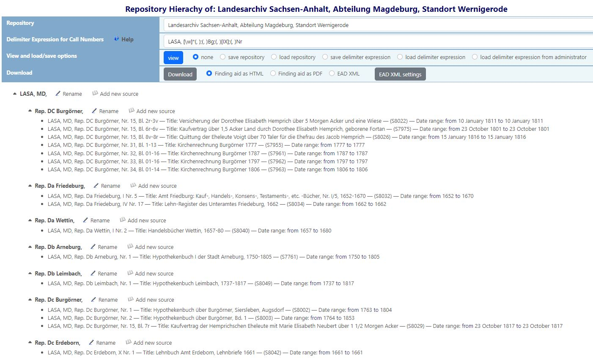
		
##  Table of contents
This README file contains the following main sections:What](
*   [Overview](#repository-hierarchy-overview)
*   [Screenshot](#screenshot)
*   [Table of contents](#table-of-contents)
*   [What are the benefits of using this module?](#what-are-the-benefits-of-using-this-module)
*   [Installation](#installation)
*   [Webtrees version](#webtrees-version)
*   [Concepts of the Repository Hierarchy module](#concepts-of-the-repository-hierarchy-module)
*   [**How to use the module?**](#how-to-use-the-module)
    *   [Using delimiters](#usage-of-a-single-delimiter)
    *   [Save and load options](#save-and-load-options)
    *   [Rename a call number category](#rename-a-call-number-category)
    *   [Add a new source to a call number category](#add-a-new-source-to-a-call-number-category)
    *   [Provide and show titles for call number categories](#provide-and-show-titles-for-call-number-categories)
    *   [Using a meta repository](#using-a-meta-repository)
    *   [Using a combined meta repository](#using-a-combined-meta-repository)
    *   [Generate and download a finding aid document](#generate-and-download-a-finding-aid-document)
    *   [Demo download for a finding aid document](#demo-download-for-a-finding-aid-document)
    *   [Generate and download an EAD XML export](#generate-and-download-an-ead-xml-export)
    *   [Settings for EAD XML exports](#settings-for-ead-xml-exports)
    *   [Export data to an external archive management system](#export-data-to-an-external-archive-management-system)
    *   [Create links between webtrees and an external archive management system](#create-links-between-webtrees-and-an-external-archive-management-system)
    *   [Show additional repository information in source citations](#show-additional-repository-information-in-source-citations)
    *   [Directly show media objects of source citations in individual facts](#directly-show-media-objects-of-source-citations-in-individual-facts)
    *   [Additionally show media objects of sources in individual and family facts](#additionally-show-media-objects-of-sources-in-individual-and-family-facts)
    *   [Copy-Paste mechanism for source citations in the individual and family view](#copy-paste-mechanism-for-source-citations-in-the-individual-and-family-view)
    *   [Show all images of media objects](#show-all-images-of-media-objects)
    *   [Preferences](#preferences)
*   [**Demo website and examples**](#demo-website-and-examples)
    *   [Demo website and examples for a meta repository](#demo-website-and-examples-for-a-meta-repository)
*   [Some more background about archive and library management](#some-more-background-about-archive-and-library-management)
    *   [Archival Arrangement](#archival-arrangement)
    *   [Library classification](#library-classification)
    *   [Finding Aids](#finding-aids)
    *   [Call numbers](#call-numbers)
    *   [Relationship between Archival Arrangement and Call numbers](#relationship-between-archival-arrangement-and-call-numbers)
    *   [EAD standard for XML export of archival records](#ead-standard-for-xml-export-of-archival-records)
    *   [apeEAD standard for XML export of finding aids](#apeead-standard-for-xml-export-of-finding-aids)
*   [How the module maps to Gedcom and to archive management concepts](#how-the-module-maps-to-gedcom-and-to-archive-management-concepts)
*   [Translation](#translation)
*   [Bugs and feature requests](#bugs-and-feature-requests)
*   [Github repository](#github-repository)

##  What are the benefits of using this module?
+ Provide a better overview of sources in a repository
+ Improve the insight into repository structures and content
+ Find and remove inconsistencies between call numbers in repositories
+ Get additional features to rename call number categories (or groups of call numbers)
+ Get better support to design an archive arrangement/classification for your own archive and manage the corresponding call numbers
+ Generate a finding aid document (i.e. table of content or catalog) for a repository
+ Export the data of a repository to an external archive management system by using the EAD XML export
+ Create links between webtrees and an external archive management system
+ Generate a standardized archive EAD XML file to export the data of a repository to an archive portal
+ Show more information about sources, source citations, archives, and images of sources/citations in the user frontend
+ Copy source citations from one fact/event to another fact/event by clicking icons in the user frontend

##  Installation
+ Download the [latest release](https://github.com/Jefferson49/RepositoryHierarchy/releases/latest) of the module
+ Copy the folder "repository_hierarchy" into the "module_v4" folder of your webtrees installation
+ Check if the module is activated in the control panel:
    + Login to webtrees as an administrator
	+ Go to "Control Panel/All Modules", and find the module called "Repository Hierarchy" (or corresponding translation)
	+ Check if it has a tick for "Enabled"
+ If the feature ["copy-paste mechanism for source citations in the individual and family view"](#copy-paste-mechanism-for-source-citations-in-the-individual-and-family-view) shall be used in paralell with the [vesta custom modules](https://github.com/vesta-webtrees-2-custom-modules), a vesta version 2.1.17.0.4 or later needs to be installed.
+ If Repository Hierarchy is used, **it is strongly recommended to deactivate the [**webtrees-simple-media-display**](https://github.com/JustCarmen/webtrees-simple-media-display) (control panel: "Media Display as in webtrees 2.0")**, because parallel activation can lead to unintended behavior. The identical functionality of the Simple Media Display module - even the same code - is also integrated in the Repository Hierarchy module.

##  Webtrees version  
The latest release of the module was developed and tested with [webtrees 2.1.17](https://webtrees.net/download), but should also run with any other webtrees 2.1 version.

##  Concepts of the Repository Hierarchy module
In the following, the concepts of the Repository Hierarchy module are described. 

###  Call number categories
In the module, a new concept "Call numbers category" is introduced. Call number categories are defined as hierarchical elements, which constitute the structure of an archival arrangement.

###  Relationship between call number categories, call numbers, and delimiters
Call number categories are extracted form call numbers. The module identifies sub-strings in call numbers as call number categories by using delimiters. A chosen delimiter (or a set of delimiters) cuts the full call number into sub-strings of call number categories.

Example call number structure:
"Fonds/Record group/Series/Folder/Source"

In this case, the module identifies the following strings as **call number categories**:
+ Fonds
+ Record group
+ Series
+ Folder
+ Source

Based on the identified call number categories, the module creates the following hierarchical structure for the archive:
+ Fonds
    + Record group
        + Series
            + Folder
                + Source
				
###  Delimiter expressions for call numbers
A delimiter is a sequence of one or more characters for specifying the boundary between separate, independent regions in a text. In the Repository Hierarchy module, delimiters are used to cut call numbers into sub-strings of call number categories. The call number categories will be used to construct a hierarchy of call numbers.

##  How to use the module?

###  Usage of a single delimiter
A single delimiter is used by providing a single character or a sequence of characters in the related input form ("delimiter expression"). 

Example:
+ Call numbers:
    + Fonds/Series/Item 1
    + Fonds/Series/Item 2
+ Delimiter expression: **/**
+ Repository Hierarchy:
    + Fonds/
        + Series/
            + Item 1
            + Item 2

###  Usage of a set of delimiters
A set of delimiters is used by providing the delimiters in the input form ("delimiter expression") separated by "**;**".

Example:
+ Call numbers:
    + Fonds/Series-Item 1
    + Fonds/Series-Item 2
+ Delimiter expression: **/;-**
+ Repository Hierarchy:
    + Fonds/
        + Series-
            + Item 1
            + Item 2

In a set of delimiters, the delimiters are evaluated from left to right, i.e. the most left delimiter is evaluated first. Delimiters will also be applied recursively for as many matches as possible. Only if no further matches of a delimiter are found, the next delimter is evaluated.

Example:
+ Call number:
    + Fonds A/Record-group/Series A-Nr. 7
+ Delimiter expression: **/;-**
+ Repository Hierarchy:
    + Fonds A
        + Record-group
            + Series A
                + Nr. 7		

I.e. the "-" delimiter in "Record-group" is not evaluated, because the "/" delimiter is evaluated first. After all matches of the "/" delimiter have been evaluated, the "-" delimiter is found in "Series A-Nr. 7".
	
###  Usage of a regular expression for the delimiter
A [regular expression](https://en.wikipedia.org/wiki/Regular_expression) is used by providing it in the input form ("delimiter expression"). The regular expression needs to contain the delimiter in brackets. This provides a much more powerful way to specify delimiters.

Please note, that the "full" regular expression will be used to find a certain pattern in the call numbers. However, **only the characters in the brackets** ("the match" of the regular expression) **will be used as the delimiter**.

Example:
+ Call numbers:
    + Film Number 5
    + Film Number 8
+ Delimiter expression: **Film( )Number**
+ Repository Hierarchy:
    + Film
        + Number 5
        + Number 8

In this example, the delimiter is the space character in the brackets, i.e. "**( )**". However, the full pattern "**Film( )Number**" is used to find corresponding strings. Therefore, only space characters, which match the pattern, are identified as delimiter. Other space characters, are NOT identified as delimiter.

###  Usage of a set of regular expressions for the delimiter
A set of regular expressions can be used by providing several regular expressions in the input form ("delimiter expression") separated by "**;**". It is also possible to mix simple delimiters (i.e. a single character or sequence of characters) with regular expressions.

Example:
+ Call numbers:
    + Fonds A, Biography Number 1
    + Fonds D, Photo Number 7
+ Delimiter expression: **Fonds \[A-D](, );( )Number**
+ Repository Hierarchy:
    + Fonds A,
        + Biography
            + Number 1
    + Fonds D,
        + Photo
            + Number 7

Like for a set of simple delimiters, the delimiter expressions are evaluated from left to right. Please refer to the description and example for a set of simple delimiters.

###  Save and load options
By pressing certain radio buttons in the front end, certain load and save operations can be executed while pressing the "view" button. 

####  Save and load a repository
If the "save repository" radio button is activated while the "view" button is pressed, the currently selected repository will be stored for the active user. 

If the "load repository" radio button is activated while the "view" button is pressed, the module will load a stored repository of the user if already stored.

####  Save and load a delimiter expression
If the "save delimiter expression" radio button is activated while the "view" button is pressed, the current delimiter expression will be stored for the active user. If the user is administrator, the expression will also (parallely) be stored as adminstrators' delimiter expression.

If the "load delimiter expression" radio button is activated while the "view" button is pressed, the module will load a stored delimiter expression of the user if already stored.

If the "load delimiter expression from administrator" radio button is activated while the "view" button is pressed, the module will load a stored delimiter expression of the administrator(s) if available.

###  Rename a call number category
By opening the "Rename" link close to a call number category, a data fix page with a search/replace form is opened, where the name of the chosen call number can be modified.

###  Add a new source to a call number category
By opening the "Add new source" link close to a call number category, a form is opened, which allows to add a new source to the chosen call number. When opening the form, a "{new}" placeholder is inserted, which should be modified by the user.

While the "{new}" placeholder should be modified, the rest of the call number, which consists of the call number category hierarchy should only be modified if the "route" or "path" of the call number category shall also be changed. If the intention is to simple add a new source to an existing call number category, only the "{new}" placeholder should be changed.

###  Provide and show titles for call number categories
While the Repository Hierarchy module can generate call number categories from call numbers, the webtrees and GEDCOM data model does not provide features to describe the call number categories. To fill this gap, the Repository Hierarchy module offers a possibility to describe and view titles for the call number categories. 

The following two screenshots show examples for the titles in the module browser front end and in an exported finding aid.

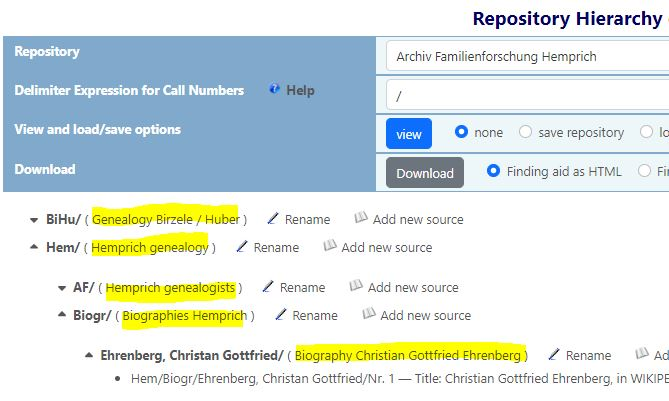

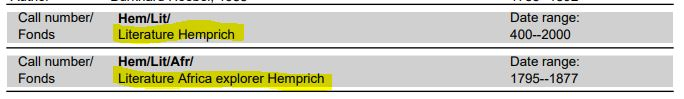

In order to provide titles for call number categories, the Repository Hierarchy module uses a mechanism based on [gettext](https://en.wikipedia.org/wiki/Gettext) and .po files, which is frequently used for translation of software projects. In the context of the Repository Hierarchy module, call number categories are "translated" into titles.

Everytime a repository hierarchy for a repository is shown in the browser front end, a gettext file is generated and stored in the /resources/caln/ folder of the Repository Hierarchy module. The gettext file with the name "\<tree name\>_\<repository XREF\>.php" contains all call number categories of the related repository.

In order to provide category titles, a .po editor like [Poedit](https://poedit.net/) can be used to "translate" the call number categories into titles. It is also possible to use a simple text editor; however, a .po editor offers more comfortable features for .po updates and plausibility checks. The translation files need to have the following name: "\<tree name\>_\<repository XREF\>_\<language tag\>.po". If a .po file is provided without language tag (i.e. "\<tree name\>_\<repository XREF\>.po"), it is used as a default for all languages without specifically provided .po files.

An example with the related files in the /resources/caln/ folder is shown in the following screenshot.

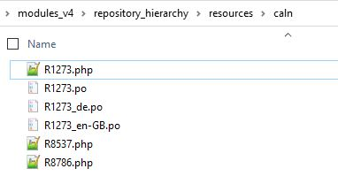

###  Using a meta repository
A meta repository provides the possibility to view sources of a set of repositories in a shared hierarchy. The basic idea is to share a common namespace for call number categories between sources from different repositories. The common namespace can also be seen as common archival arrangement for the related sources.

A meta repository can be added in webtrees as a "regular" repository without specific extensions. While no restrictions apply, it is proposed to use the prefix "Meta:" in the repository name.

All the sources, which are planned to be integrated in the meta respository, need to be assigned to the meta repository and also need to be assigned call numbers within the context of the meta repository. The call numbers within the meta respository should follow the approach of a common namespace or a common archival arrangement.

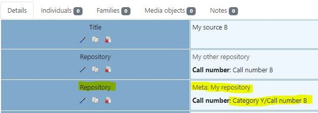

Given that the mentioned definiton and assignment of the meta repository is available, it can be used and viewed with the Repository Hierarchy module. The handling is the same like for a single repository, but it provides the means to view and organize a much broader range of sources.

###  Using a combined meta repository
The Repository Hierarchy module offers a feature to combine a meta repository with a base repository. Like in the last chapter, the intention is again to share a common namespace between the meta repository and the base repository. By combining the base repository, it is not necessary to add the meta repository to each of the sources of the base repository. This is especially useful, if the base repository is the "home" of the user's genealogy and contains a lot of sources. 

The Repository Hierarchy module will provide means to view a combined view of all the sources of the base repository and all the sources of the meta repository. In order to activate these features, the following setting needs to be selected in the control panel: "Use Meta Repositories".

To make the relationship between the repositories more visible, ít is proposed to use the same repository name and a prefix "Meta:" for the meta repository. An example is shown in the following screenshot. 

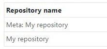

In order to link the meta repository to the base repository, the XREF of the meta repository needs to be assinged as a user defined "Reference number" (i.e. Gedcom tag REPO:REFN) to the base repository. Additionally, the "Reference number" needs to be assigned the type "META_REPOSITORY" (i.e. Gedcom tag REPO:REFN:TYPE).

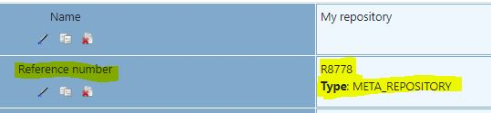

Given that the mentioned definiton and assignment of the meta repository is available, the Repository Hierarchy module will include all the sources of the meta repository when viewing the structure of the base repository. The handling is the same like for a single repository, but it provides the means to view and organize a much broader range of sources. It is even possible to view all sources of a webtrees tree in one Repository Hierarchy view.

More details can be found in the [chapter Demo website and examples](#demo-website-and-examples).

### Generate and download a finding aid document
A [finding aid](https://en.wikipedia.org/wiki/Finding_aid) document contains detailed, indexed, and processed metadata and other information about a specific collection of source records within an archive. More simple, it is a (hiearchical) list of sources in an archive with additional metadata. 

The **benefit of a finding aid document is to provide a fast overview of the available sources for a user/visitor of an archive**. It also provides insights about the structure of the archive and the kind of sources, which can be found in the archive.

With the Repository Hierarchy module, webtrees can generate a finding aid document for a chosen repository. After selecting the Repository Hierarchy module from the list menu, a repository can be chosen and a [delimiter expression](#usage-of-a-single-delimiter) needs to be provided. The chosen delimiter expression will be used to generate and view a hierarchical structure for the repository.

Based on the generated repository and call number structure, a finding aid document can be generated and downloaded by **clicking** the **"Download" button** and selecting one of the options **"Finding aid as HTML"** or **"Finding aid as PDF"**. 

The generated finding aid document contains the following metadata for each of the sources:
+ Call number
+ Title
+ Author
+ Date range
+ Gedcom-ID and webtrees link (optional)

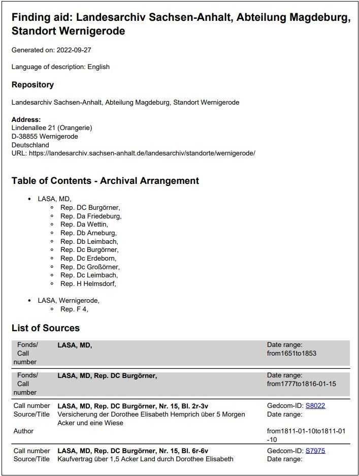

### Demo download for a finding aid document

An example for a finding aid document can be downloaded with the following [link](https://www.familienforschung-hemprich.de/index.php/de/pdf-download-3?task=download.send&id=13&catid=2&m=0).

In page 1-6 of this example, a preface was added with a word processing software. The pages starting from page 7 were generated by the Repository Hierarchy module. 

### Generate and download an EAD XML export
With the Repository Hierarchy module, webtrees can generate an [EAD XML](#ead-standard-for-xml-export-of-archival-records) export for a chosen repository. The export is provided in [apeEAD](#apeead-standard-for-xml-export-of-finding-aids) XML. 

The EAD XML export contains:
+ Metadata about the repository (i.e. name, address, ...)
+ Metadata about the repository structure (i.e. hierarchy, call numbers, fonds, collections, files, ...)
+ Metadata about the sources in the repository (i.e. title, author, date range, ...)

After selecting the Repository Hierarchy module from the list menu, a repository can be chosen and a [delimiter expression](#usage-of-a-single-delimiter) needs to be provided. The chosen delimiter expression will be used to generate and view a hierarchical structure for the repository.

Based on the generated repository and call number structure, an EAD XML export can be generated and downloaded by **clicking** the **"Download" button** and selecting the option **"EAD XML"**. 

### Settings for EAD XML exports
In order to generate EAD XML exports, some settings need to be provided. 

The EAD XML settings can be provided by **clicking** the **"EAD XML settings" button**. A specific window will open to enter the values.

Within the EAD XML settings window, a button is available to load the settings from an administrator. Hence, if an administrator provided values for the EAD XML settings, they can be loaded and used.

The [apeEAD](#apeead-standard-for-xml-export-of-finding-aids) standard, which is used for the export, requires to provide at least the following values:
+ Finding aid title
+ Country code
+ Main agency code
+ Finding aid identifier

Additionally, the following values can be provided:
+ URL of the online finding aid
+ Publisher

The Repository Hierarchy module will provide a default proposal for the values.

The **main agency code** is an unique code identifying the archival institution maintaining the described collection; encoded according to ISO 15511 (ISIL). The main agency code is officially assigned to archives by a national authority. As a substitute value (e.g. for a private or inofficial archive), the country code and "-XXXXX" might be chosen, e.g. FR-XXXXX.

### Export data to an external archive management system
The EAD XML exports described in the section "[Generate and download an EAD XML export](#generate-and download-an-ead-xml-export)" can be used to transfer data from webtrees to an external archive management system.

Some examples for archive management systems:
+ [AtoM](https://www.accesstomemory.org/)
+ [CollectiveAccess](https://collectiveaccess.org/)
+ [ArchivesSpace](https://archivesspace.org/)

The EAD export of the Repository Hierarchy module was tested with AtoM. Further details about AtoM import can be found in the [AtoM import documentation](https://www.accesstomemory.org/de/docs/2.6/user-manual/import-export/import-xml/#import-xml).

For re-importing EAD XML from the same webtrees repository, the AtoM setting "Ignore matches and import as new" should be used. The re-import will generate a new (parallel) archival institution in AtoM. To add (newly imported) sources to the exiting archival institution, they can be selected from the imported structure and moved within AtoM to the available structure. Please note that AtoM does not offer features to sync and update existing records. For more details, please refer to the [AtoM documentation for XML imports](https://www.accesstomemory.org/en/docs/2.6/user-manual/import-export/import-xml#matching-critera-for-description-xml-imports).

### Create links between webtrees and an external archive management system
When exporting webtrees data to an external archive system, linking between webtrees and the external system helps to connect the two systems and to keep redundancy at a mimimum.

The following concept was tested with the [AtoM](https://www.accesstomemory.org/) archive management system. If you are interested to interact with other archive management systems, please contact the [module author](https://www.familienforschung-hemprich.de/index.php/en/contact) for further clarifcation and discussion.

While exporting data from webtrees with an EAD XML export, a XML structure with URLs to each of the sources in webtrees is included. After importing the EAD XML into AtoM, the links are shown in the user interface and can be used to navigate to the related webtrees source.

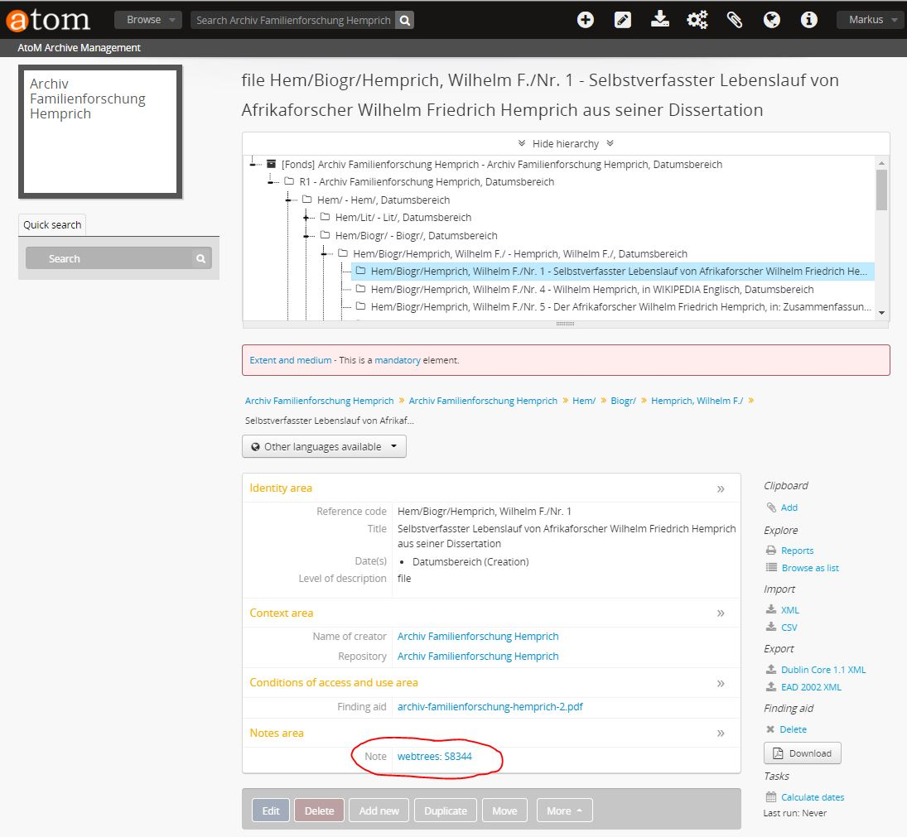

Within webtrees, the Repository Hierarchy module can provide links to the related AtoM records. In order to use this feature, the following steps need to be taken:
+ Settings in webtrees:
    + Open the webtrees preferences for the Repository Hierarchy module in the control panel 
    + Set the preferences for linking to external archive management tools, specifically for AtoM
    + Specify, whether to use call numbers or source titles to create AtoM REST links ("AtoM slugs")
    + Also activate the feature "Show additional source facts (REPO, REPO:CALN, REFN, NOTE) within source citations"
+ Settings in AtoM:
    + Open settings / global settings in AtoM and set the permalinks in AtoM to call numbers or source titles. It is important to use the same settings in AtoM like in webtrees. More information about the AtoM permalinks settings can be found in the [AtoM documentation](https://www.accesstomemory.org/en/docs/2.6/user-manual/administer/settings/#description-permalinks).
    + Depending on the settings in AtoM, it might also be necessary to re-generate slugs (i.e. permalinks) in Atom. More information can bei found in the [AtoM documentation](https://www.accesstomemory.org/en/docs/2.6/admin-manual/maintenance/cli-tools/#generate-slugs).

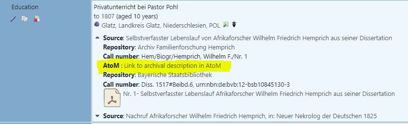

### Show additional repository information in source citations
The Repository Hierarchy modules provides a feature to show extended information within source citations. If one of the following GEDCOM tags is available and contains content, it is shown in the user interface:
+ REPO (name of repository)
+ REPO:CALN (call number of the source in the repository)

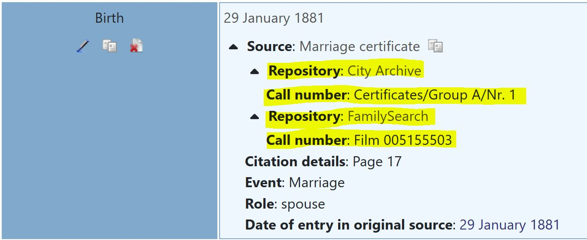

In order to activate this feature, the setting "Show additional source facts (REPO, REPO:CALN) within source citations" needs to be selected in the control panel.

Note: An additional setting exists to define whether repositories are automatically expanded in source citations.

Note:Additionally, it is possible to show links to AtoM (as an external archive management system) within the source citations. The details are described in the related [chapter](#create-links-between-webtrees-and-an-external-archive-management-system).

### Directly show media objects of source citations in individual and family facts
The Repository Hierarchy modules provides a feature to directly show media objects of source citations in individual and family facts (and not subordinated in the source citation).

**Screenshot of individual fact with directly shown media objects:**
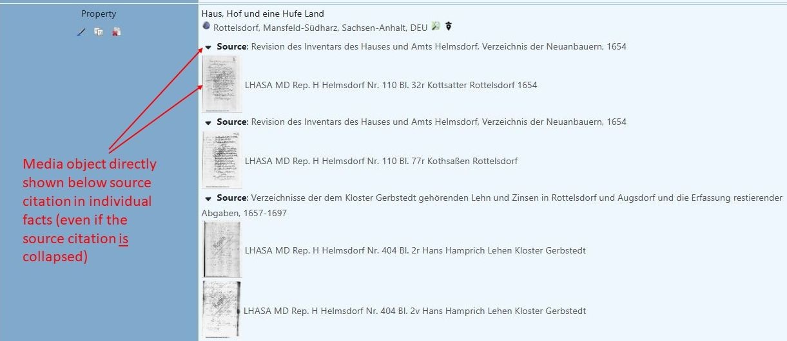

**Screenshot of individual fact with media objects subordinated to source citation:**
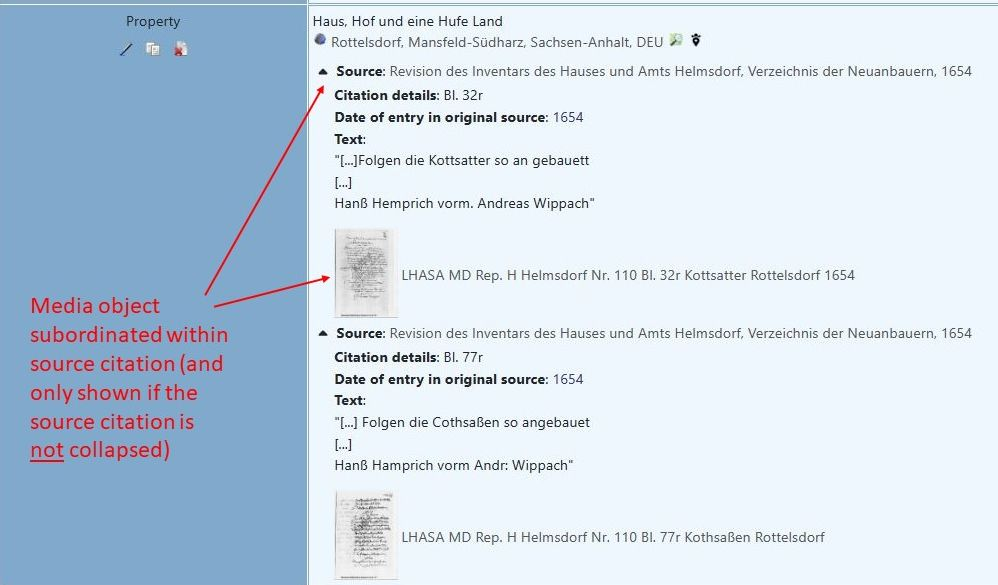

In order to activate this feature, the setting "Directly show media objects of sources in facts and not subordinated within source citations" needs to be selected in the control panel.

### Additionally show media objects of sources in individual and family facts
The Repository Hierarchy modules provides a feature to show media objects of sources in individual and family facts. The media objects are shown in a division "Media objects of source" below the source. The division is collapsed by default and can be un-collapsed with a mouse click.

Please note that media objects of source citations have to be differentiated from media objects of sources. This chapter addresses media objects of **sources**. In the chapters above, Repository Hierarchy also offers features, which address media objects of **sources citations**.

**Screenshot of family fact with media objects of a source:**
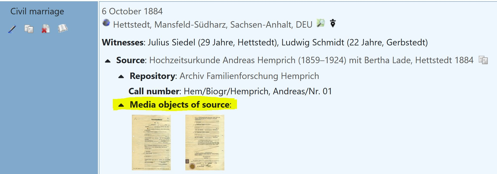

In order to activate this feature, the setting "Show all media objects of sources within a source citations" needs to be selected in the control panel.

### Copy-Paste mechanism for source citations in the individual and family view
The Repository Hierarchy module provides a feature to copy/paste source citations. If this feature is activated in the module settings, a copy icon is shown on the right hand side of each source citation. By clicking on the icon, the source citation can be copied to an internal clipboard. If a source citation is available in the clipboard, a source icon is shown in the edit area of all facts/events, which allow to use source citations. By clicking on the source icon, the source citation can be copied from the clipboard to the fact/event.

**Screenshot: Copy/Paste of source citations**

In order to activate this feature, the setting "Enable copy/paste mechanism for source citations in the individual and family view" needs to be selected in the control panel.

### Show all images of media objects

The functionality of the custom module [webtrees-simple-media-display](https://github.com/JustCarmen/webtrees-simple-media-display) developed by [Carmen Just](https://github.com/JustCarmen) was fully integrated into Repository Hierarchy. The objective of this module is to show all images of media objects. Webtrees allows to add several images to media objects. However, a lot of views in the frontend only show the first image. With the extension of Carmen Just, all media objects can be shown.

**Screenshot: Show multiple images of media objects**
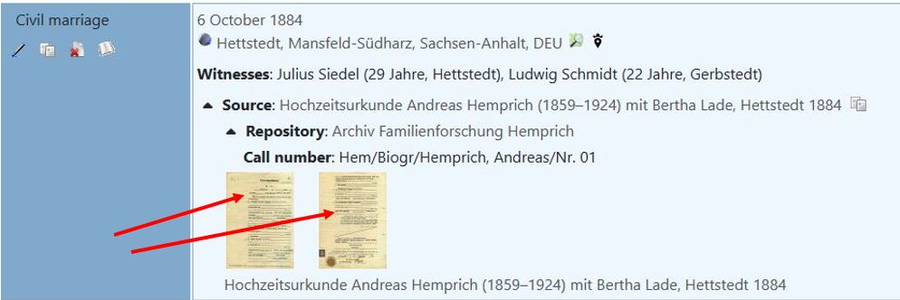

Since both - Repository Hierarchy and webtrees-simple-media-display - do change the same webtrees views to show media objects, **it is strongly recommended to deactivate the webtrees-simple-media-display (control panel: "Media Display as in webtrees 2.0")** if Repository Hierarchy is used, because parallel activation can lead to unintended behavior. The identical functionality of webtrees-simple-media-display - even the same code - is also integrated in the Repository Hierarchy module.

**Screenshot: Warning: webtrees-simple-media-display is activated in parallel**
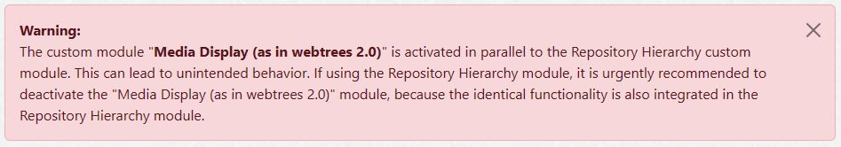

###  Preferences
The following preferences can be activated/deactivated by administrators in the control panel.

#### Preferences for the main Repository Hierarchy list
+ Show label before call number category.
+ Show titles of call number categories (if available from .po file).
+ Show help icon after label for delimiter expression.
+ Show help link after label for delimiter expression.
+ Use truncated categories. The call number categories will be truncated and shown without the trunk.
+ Use truncated call numbers. The call numbers will be truncated and shown without call number category.
+ Allow renaming of call number categories. Will show an icon and a link for renaming.
+ Allow adding new sources to a call number category. Will show an icon and a link to add new sources.
+ Show the title of the sources.
+ Show the XREF of the sources.
+ Show the author of the sources.
+ Show the date range of the sources.
+ Allow users to load stored delimiter expressions from administrator.

#### Preferences for source citations
+ Show additional source facts (REPO, REPO:CALN) within source citations.
+ Automatically expand repositories in source citations. Applies only if "Show additional source facts" is activated.
+ Show all media objects of sources within a source citations.
+ Directly show media objects of sources in facts and not sub-ordinated within source citations.
+ Enable copy/paste mechanism for source citations in the individual and family view.

#### Preferences for finding aid export
+ Show titles of call number categories (if available from .po file).
+ Include repository address within finding aid export.
+ Include links to webtrees sources within finding aid export.
+ Include table of contents within finding aid export.
+ Show titles within table of contents in finding aid export. 
+ Show links within table of contents in finding aid export (not available for PDF export).

#### Preferences for EAD XML exports
+ Allow users to load stored XML settings from administrator.

#### Preferences for Meta Repositories
+ Use meta repositories.

#### Preferences for linking to external archive management tools
+ Show link to AtoM records within source citations.
+ Use call numbers to create AtoM REST links ("AtoM slugs")
+ Use source titles to create AtoM REST links ("AtoM slugs")
+ [AtoM](https://www.accesstomemory.org/) base ULR to be used for the generation of links to an [AtoM](https://www.accesstomemory.org/) archive management system.
+ Repositories, for which [AtoM](https://www.accesstomemory.org/) linking is used.

## Demo website and examples
The following links provide access to a demo website, which demonstrates some of the module features.

+ Demo website for the [**Repository Hierarchy module**](https://www.familienforschung-hemprich.de/webtrees2/index.php?route=%2Fwebtrees2%2Ftree%2Fhemprich%2Frepositoryhierarchy%2Fxref%2F%7Bxref%7D%2Fcommand%2F%7Bcommand%7D&delimiter_expression=&language=en-GB)

+ Example for a [**Source Record**](https://www.familienforschung-hemprich.de/webtrees2/index.php?route=%2Fwebtrees2%2Ftree%2Fhemprich%2Fsource%2FS8685%2FKirchenbuch-Deubach-Taufen-1670-1804&language=en-GB) with source repository citation (and 2nd citation for a meta repository)

+ Example for an [**Individual Record**](https://www.familienforschung-hemprich.de/webtrees2/index.php?route=%2Fwebtrees2%2Ftree%2Fhemprich%2Findividual%2FI6684%2FLeonhard-Kastler&language=en-GB) with source citations

### Demo website and examples for a meta repository
Additionally to the above demo website links, the following links, examples, and GEDCOM snippets demonstrate the features of the Repository Hierarchy module, which make use of a meta repository.

+ Example for a [**Meta Repository**](https://www.familienforschung-hemprich.de/webtrees2/index.php?route=%2Fwebtrees2%2Ftree%2Fhemprich%2Frepository%2FR8773%2FMeta-Archiv-Familienforschung-Hemprich&language=en-GB)

+ Example for a [**Base Repository**](https://www.familienforschung-hemprich.de/webtrees2/index.php?route=%2Fwebtrees2%2Ftree%2Fhemprich%2Frepository%2FR1%2FArchiv-Familienforschung-Hemprich&language=en-GB)

Please note in this webtrees demo site, how the Base Repository is linked to the meta repository: 

>Reference number: R8773  
Type: META_REPOSITORY

The following GEDCOM snippets show the usage of a meta repository in the INDI, SOUR, and REPO structures of webtrees/Gedcom. The snippets are related to the demo website above; the XREFs from the snippets can be directly found on the demo website.

>0 @I6684@ INDI  
1 NAME Leonhard /Kastler/  
1 BIRT  
2 DATE 03 NOV 1735  
2 PLAC Deubach, Landkreis Guenzburg, Bayern, DEU  
2 SOUR @S8685@  
3 PAGE Seite 62, https://data.matricula-online.eu/de/deutschland/augsburg/deubach/1-T/?pg=33  

>0 @S8685@ SOUR  
1 TITL Kirchenbuch Deubach, Taufen 1670-1804  
1 DATA  
2 EVEN BAPM  
3 DATE FROM 1670 TO 1804  
3 PLAC Deubach, Landkreis Guenzburg, Bayern, DEU  
1 REPO @R7328@  
2 CALN Deubach, 1-T, https://data.matricula-online.eu/de/deutschland/augsburg/deubach/1-T  
3 MEDI ELECTRONIC  
1 REPO @R8773@  
2 CALN BiHu/Kop/KB/Deubach, Landkreis Guenzburg, Bayern, DEU/Taufen 1670-1804  

>0 @R1@ REPO  
1 NAME My Family Archive  
1 REFN R8773  
2 TYPE META_REPOSITORY  

>0 @R8773@ REPO  
1 NAME Meta: My Family Archive  

>0 @R7328@ REPO  
1 NAME Matricula Online  

In this example, R1 is the base repository, R8773 the meta repository, and R7328 is just some other repository. With the Gedcom lines "1 REFN R8773  2 TYPE META_REPOSITORY", the meta repository is combined with the base repository. If the Repository Hierarchy module identifies this relationship, the two repositories (e.g. R1 and R8773) are combined and shown in the same hierarchical view. In order to create a benefit from this concept, the two repositories should use the same call number format (i.e. same delimiters, and the same call number category structure).

Please note that combining the base repository (R1) to the meta repository (R8773) mainly reduces effort and avoids redundancy for source repository citations of sources in the base repository. This is illustrated by the following example for a source in the base repository R1:

**Example 1**  
Source with "double" source repository citations (one for the base repository, and a second one for the meta repository)  
>0 @S8765@ SOUR  
1 TITL Hochzeit Litzel-Hartmann, Standesamt Fleinhausen, 1902  
1 REPO @R1@  
2 CALN LiHa/Biogr/Litzel, Maximilian/Nr. 01  
1 REPO @R8773@  
2 CALN LiHa/Biogr/Litzel, Maximilian/Nr. 01  

**Example 2**  
Source with "single" source repository citations (if using a combined meta repository). In this case, the second source repository citation (for the meta repository) is not needed!  
>0 @S8765@ SOUR  
1 TITL Hochzeit Litzel-Hartmann, Standesamt Fleinhausen, 1902  
1 REPO @R1@  
2 CALN LiHa/Biogr/Litzel, Maximilian/Nr. 01  

It is important to notice that both examples are equaly working and both make use of the meta repository. However, the second example avoids redundancy and needs less work.

## Some more background about archive and library management
In archive (or library) management, archival arrangements, library classifications, finding aids, and call numbers are frequently used to:
+ define a structure for an archive
+ assign item numbers to the sources in the archive
+ provide a catalog or finding aid for the archive

In the following, some of the typical concepts are briefly described.

### Archival Arrangement
[Wikipedia](https://en.wikipedia.org/wiki/Finding_aid): "Arrangement is the manner in which \[the archive] has been ordered \[...]. Hierarchical levels of arrangement are typically composed of record groups containing series, which in turn contain boxes, folders, and items."

### Library classification
[Wikipedia](https://en.wikipedia.org/wiki/Library_classification): "A library classification is a system of knowledge distribution by which library resources are arranged and ordered systematically."

###  Finding Aids
[Archive Portal Europe](https://www.archivesportaleurope.net/?show=help): "A finding aid is a structured description of archival materials per collection or fonds up to item level"

[Wikipedia](https://en.wikipedia.org/wiki/Finding_aid): "A finding aid for an archive is an organization tool, a document containing detailed, indexed, and processed metadata and other information about a specific collection of records within an archive."

### Call numbers
[Wikipedia](https://en.wikipedia.org/wiki/Library_classification): "\[...] a call number (essentially a book's address) based on the classification system in use at the particular library will be assigned to the work using the notation of the system."

### Relationship between Archival Arrangement and Call numbers
A lot of archives (and libraries) map the archival arrangement (or library classification) into the call numbers of the sources. 

For example, the archive might have the following arrangement:
+ Fonds
    + Record group
        + Series
            + Folder
                + Source

In this case, the call numbers might have the following structure:

**"Fonds/Record group/Series/Folder/Source"**

Therefore, the hierarchy of the archival arrangement is represented in the "route" or the "path" of the call number. 

### EAD standard for XML export of archival records
Encoded Archival Description ([EAD](https://www.loc.gov/ead/)) is a standard for encoding descriptive information regarding archival records. The EAD standard provides a **XML export format**, which allows to describe and export the content and structure of archives and sources. It also provides data structures to describe and export finding aids.

See also: [Wikipedia](https://en.wikipedia.org/wiki/Encoded_Archival_Description)

### apeEAD standard for XML export of finding aids
[apeEAD](https://www.archivesportaleurope.net/tools/for-content-providers/standards/apeead/) is a standard, which was designed and published by the [Archive Portal Europe](https://www.archivesportaleurope.net/). As a sub-set of [EAD](#ead-standard-for-xml-export-of-archival-records), apeEAD was specifically designed for encoding archival finding aids. As specification of the standard, the Archive Portal Europe provides a [table](http://apex-project.eu/images/docs/apeEAD_finding_aid_table_201210.pdf) with the used EAD XML tags and a [description and best practice guide](http://apex-project.eu/images/docs/apenet_ead_finding_aid_holdings_guide.pdf) for usind ape EAD.

The Archive Portal Europe also provides a validation tool. With the [apeEAD data preparation tool](https://github.com/ArchivesPortalEuropeFoundation/ape-dpt), EAD XML exports can be validated against the apeEAD standard. Details are described in a [manual](http://apex-project.eu/index.php/en/outcomes/tools-and-manuals/data-preparation-tool-manual).

The XML exports of the Repository Hiararchy module were developed and tested to pass the validation of the apeEAD data preparation tool.

## How the module maps to Gedcom and to archive management concepts
In order to manage archives and sources, Gedcom and webtrees basically provide the following data structures:
+ Repository
+ Source
+ Call number (of a source within a repository)

The following table describes how the concepts from archive and library management are mapped to Gedcom/webtrees and the Repository Hierarchy custom module:

|Archive/Library Concept|Gedcom/webtrees data structures|Repository Hierarchy Module|
|:------|:--------------|:---------------------------|
|Archive, Library|Repository|Repository|
|Archival Arrangement, Library Classification|-|Hierarchy of call number categories|
|Fonds, Record group, Series, Folder|-|Call number category|
|Item, file, book|Source|Source|
|Call number|Call number|Call number|
|Finding aid|List of sources for a selected repository|List of sources in a hierarchy of call number categories for a selected repository|

## Translation
You can help to translate this module. The translation is based on [gettext](https://en.wikipedia.org/wiki/Gettext) and uses .po files, which can be found in [/resources/lang/](https://github.com/Jefferson49/RepositoryHierarchy/tree/main/resources/lang). You can use a local editor like [Poedit](https://poedit.net/) or notepad++ to work on translations and provide them in the [Github repository](https://github.com/Jefferson49/RepositoryHierarchy) of the module. You can do this via a pull request (if you know how to do), or by opening a new issue and attaching a .po file. Updated translations will be included in the next release of this module.

Currently, the following languages are already available:
+ English
+ Dutch
+ French
+ German

## Bugs and feature requests
If you experience any bugs or have a feature request for this webtrees custom module, you can [create a new issue](https://github.com/Jefferson49/RepositoryHierarchy/issues).

##  Github repository  
https://github.com/Jefferson49/RepositoryHierarchy